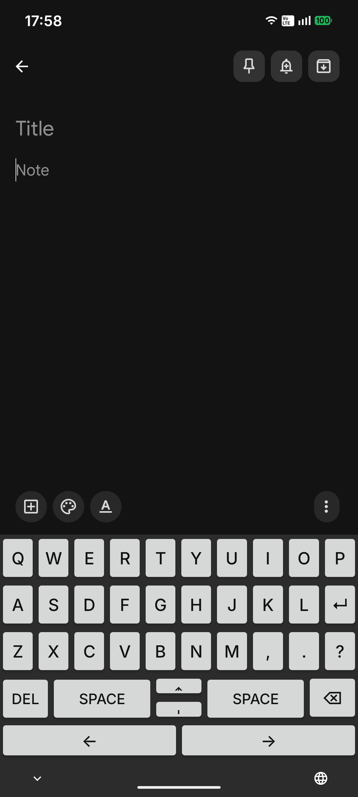
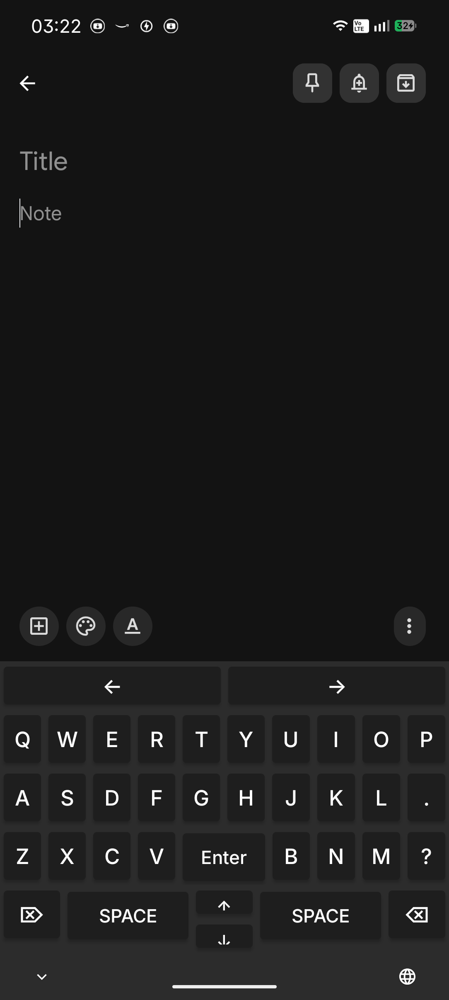

# D-Board

An ortholinear (grid-aligned) keyboard for Android that eliminates the staggered key layout inherited from mechanical typewriters.

## Why

Standard mobile keyboards use staggered QWERTY layouts designed to prevent physical key jams -- a constraint that has no relevance on a touchscreen. The stagger forces unnecessary lateral finger movement and makes muscle memory less consistent. D-Board arranges keys in a uniform grid so every column lines up vertically, reducing finger travel and making key positions predictable.

## Screenshots

| Light theme | Dark theme |
|:-----------:|:----------:|
|  |  |

## Features

- Full A-Z ortholinear layout (10-9-9 grid)
- Dual space bars (left and right thumb)
- Directional arrow keys (up/down/up/left/right)
- Delete and backspace
- Enter key centered in the letter grid
- Comma, period, and question mark
- Light and dark theme support
- Companion setup activity that launches IME settings

### Planned

- Number row
- Shift / capitalization
- Symbol and punctuation layers
- Long-press alternates
- Haptic feedback

## Build

Requires Android SDK 24+ and JDK 11.

```bash
git clone https://github.com/<your-user>/d-board.git
cd d-board
./gradlew assembleDebug
```

The APK will be at `app/build/outputs/apk/debug/app-debug.apk`.

A pre-built APK is also available in the [`releases/`](releases/) directory.

## Install

```bash
adb install app/build/outputs/apk/debug/app-debug.apk
```

Then on your device:

1. Open **Settings > System > Languages & input > On-screen keyboard**
2. Enable **OrthoKeyboard**
3. Switch to it in any text field via the keyboard-switcher icon

## Tech stack

- **Language:** Kotlin
- **UI:** Android XML layouts (grid of `Button` views)
- **Framework:** Android IME (`InputMethodService`)
- **Build:** Gradle with Kotlin DSL, Compose plugin (compose enabled in build config)
- **Min SDK:** 24 (Android 7.0)
- **Target SDK:** 36

## Project structure

```
app/src/main/
  java/
    OrthoKeyboardService.kt   # IME service — key handling
    com/example/orthokeyboard/
      MainActivity.kt         # Setup screen — opens IME settings
      ui/theme/               # Color, typography, theme definitions
  res/
    layout/
      keyboard.xml            # Ortholinear key grid
      activity_main.xml       # Setup activity layout
    xml/
      method.xml              # IME declaration
```

## License

Not yet specified.
